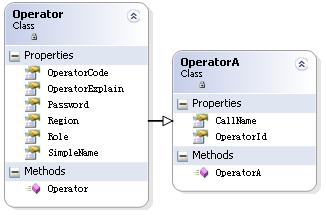

## 第一篇博客园的技术文章

不扯老远吧,就谈今天的工作.

今天解决的问题是读取较少字段但较多行的性能问题,起因是我今天需要在列表中显示一个操作员列表,现有的代码是;

``` cs
 Operator[] allOperators = OperatorManager.Open(OperatorManager.GetAllIds());
```

由于Operator是个完整的载体,将加载很多不必要的字段,特别是还包含了图片,而我仅需要一个Callname.

在一个叫PDO的开源项目中重点讲了这个问题,他的解决方案是建立一个简化的OperatorSummary,仅包含OperatorId和CallName,然后从此类继承一个完整的Operator,在读取时指定类型:

``` cs
 IList allOperators = OperatorManager.Open(typeof(OperatorSummary),OperatorManager.GetAllIds());
```



老实说这是一个好主意,但我还是觉得有些别扭,他也提到如果需要不同的简化结果,就要不同的简化类,继承关系也很难实现.

 我想应该有其它的解决办法,于是今天设计了一个:

 ``` cs
  String outProperties = "OperatorId,Callname";
    Operator[] allOperators = OperatorManager.ReadSummary(outProperties,OperatorManager.GetAllIds());
```

好处是不用设计那个简化类,而且输出更灵活,坏处吗?显而易见,载体中包含无用的未初始化的变量,且上层程序很容易误访问未初始化的字段,而且还很难觉察.

补充说一下，字段列表支持诸如： Customer.CustomerCode.DefaultCode的用点格开的组合

永远没有完美的解决方案,这只是其中一种而巳.